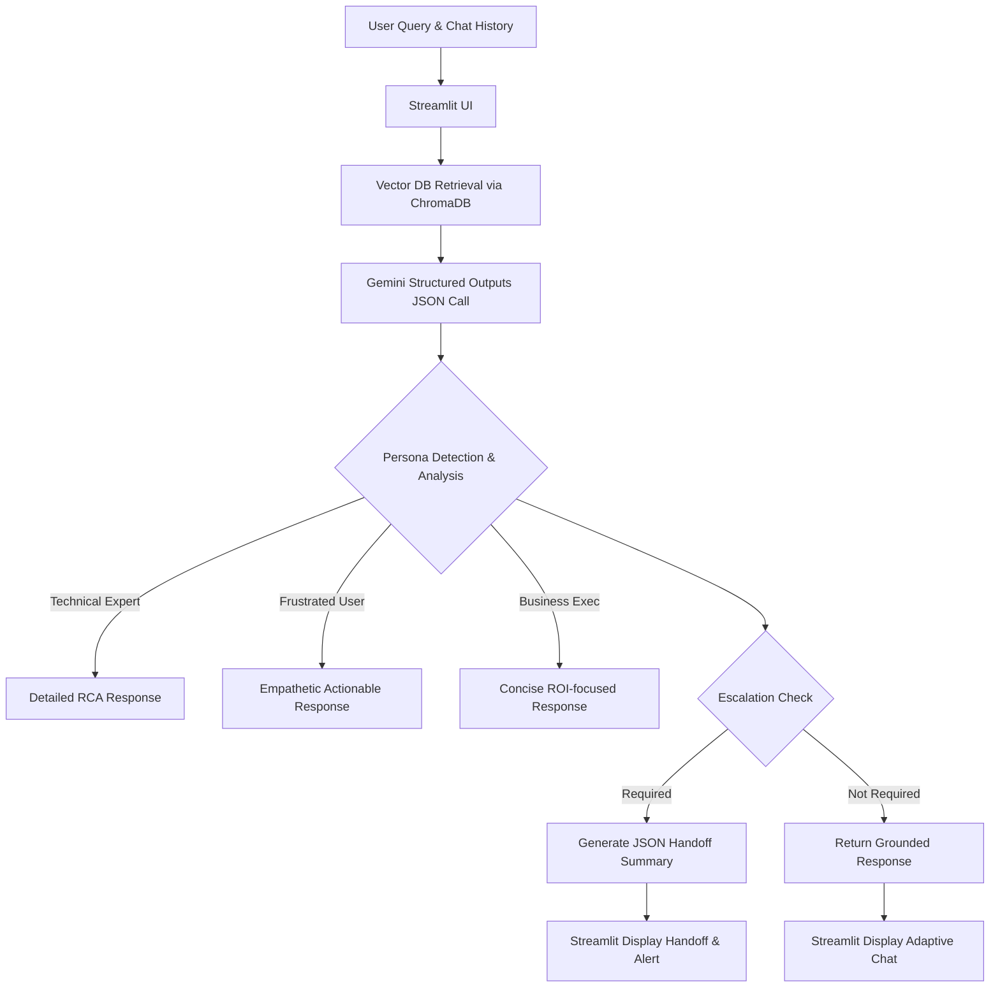

# Persona-Adaptive Customer Support Agent 📚

A Retrieval-Augmented Generation (RAG) system built with Python, Google Gemini, ChromaDB, and Streamlit. This application acts as an intelligent customer support agent capable of adapting its responses based on the customer's persona. It retrieves relevant information from a knowledge base, generates an appropriate response in a suitable tone, and escalates the conversation to a human support representative when necessary with a structured handoff.

## 🛠️ Tech Stack
- **Backend/Logic**: Python 3.11+
- **LLM**: Google Gemini (`gemini-2.5-flash-preview-09-2025` for generation)
- **Embeddings**: Google Gemini (`models/gemini-embedding-2` for vectors)
- **Vector Database**: ChromaDB (Local persistent)
- **Document Parsers**: `pypdf`, `python-docx` (with native support for `.txt` and `.md`)
- **UI Framework**: Streamlit

## 🏗️ Architecture Diagram


## 🎭 Persona Detection Strategy
The system classifies users into one of three personas dynamically per message:
- **Technical Expert**: Uses technical terminology, requests logs, wants detailed explanations.
- **Frustrated User**: Emotional language, repeated complaints, urgent requests.
- **Business Executive**: Outcome-focused, concise, interested in business impact.

**Strategy**: We use a powerful single-pass prompt with Gemini's `response_mime_type="application/json"` to perform classification based on conversational history and the immediate prompt, simultaneously alongside generation.

## 🧠 RAG Pipeline Design
1. **Chunking Strategy**: Documents are parsed by page (or file for text) and chunked using a rolling character window (`CHUNK_SIZE = 1000`, `CHUNK_OVERLAP = 200`) to ensure semantic continuity without cutting off context mid-sentence.
2. **Embedding Model**: `models/gemini-embedding-2` provides fast, accurate semantic vector representations.
3. **Vector Database Choice**: ChromaDB is used for local persistence, avoiding infrastructure overhead while providing efficient HNSW cosine-similarity queries.
4. **Retrieval Strategy**: The top 4 most semantically similar chunks (`k=4`) are injected into the system prompt. If distance thresholds are exceeded, the confidence flag triggers an escalation.

## 🚨 Escalation Logic
The system automatically sets `escalation_required = true` and generates a structured JSON summary if:
- Retrieval confidence is low (distance threshold `> 0.8` or 0 documents returned).
- The user expresses continued frustration across multiple chat turns.
- The query involves sensitive operations (billing, legal, account security).
- The knowledge base explicitly cannot resolve the issue.

When escalated, the UI presents a JSON payload containing the persona, issue summary, docs used, attempted steps, and recommended human actions.

## 🚀 Setup Instructions

### 1. Prerequisites
Ensure you have Python 3.11 or higher installed.

### 2. Install Dependencies
```bash
python -m venv venv
venv\Scripts\activate # On Windows
# source venv/bin/activate # On macOS/Linux
pip install -r requirements.txt
```

### 3. Environment Variables
Create a `.env` file in the root directory.
You must provide a valid Google Gemini API key:
```env
GEMINI_API_KEY=your_gemini_api_key_here
```

### 4. Add Documents
15 mock knowledge base documents have already been generated in the `data/` directory. You can add more `.pdf`, `.docx`, `.txt`, and `.md` files.

### 5. Run the Application
Start the Streamlit UI:
```bash
streamlit run src/main.py
```
*(Make sure your virtual environment is activated before running this command).*

### 6. Index Documents
Once the UI loads, click **"Re-index Documents"** in the sidebar to build the vector database.

## 💬 Example Queries
1. **Technical Expert**: "Can you explain the API authentication failure and provide error details for Code 1004?"
2. **Frustrated User**: "I've tried everything and nothing works! Why is my server still crashing?!"
3. **Business Executive**: "How does this recent deployment failure impact operations and when will it be resolved?"
4. **Standard Question**: "What is the data retention policy?"
5. **Escalation Trigger**: "I demand a refund for my billing overcharge this month!"

## ⚠️ Known Limitations
- **Memory Window**: Currently, the system only passes the last 5 turns to the LLM to prevent context window overflow. Very long ongoing troubleshooting sessions may lose initial context.
- **Vector Search Constraints**: ChromaDB performs purely semantic search. Exact keyword matching (e.g., searching for a specific UUID or trace ID) is not optimized without adding a hybrid search approach (like BM25).
- **Latency**: Because persona classification, escalation, and response generation all happen in one dense LLM call, TTFB (Time to First Byte) is slightly higher than an uncontrolled RAG pipeline. Future improvements include streaming the JSON response using iterative parsing.
